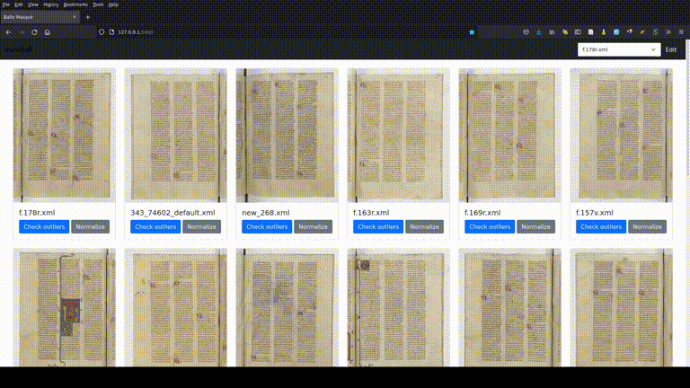

Balto Masqué
============

This software is a simple local webapp to clean up some segmentation when using ALTO. Sometime, you'll have masks that 
are all over the place, and correcting them by hand will be either expensive or impossible. This little apps proposes 
multiple ways to "normalize" masks, including by check percentiles. 

We recommend having a look at percentile, and depending on the cleanness of the masks. For **dirty masks**, we recommend
working with *close to the median* percentile, such as `45`. If you are working with mostly **clean masks**, we 
recommend *far from the median* percentile, such as `5` or `10`.

## Install

Clone the repository and do `pip install -r requirements`

## Run

Run the command from this folder:

`python -m baltomasque.cli ./PATH/TO/*.xml ./PATH2/TO/*.xml` --port 8888

and enjoy [http://localhost:8888](http://localhost:8888).

## Demo

